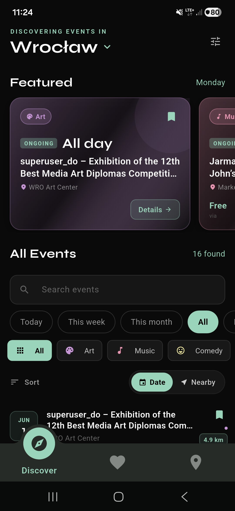
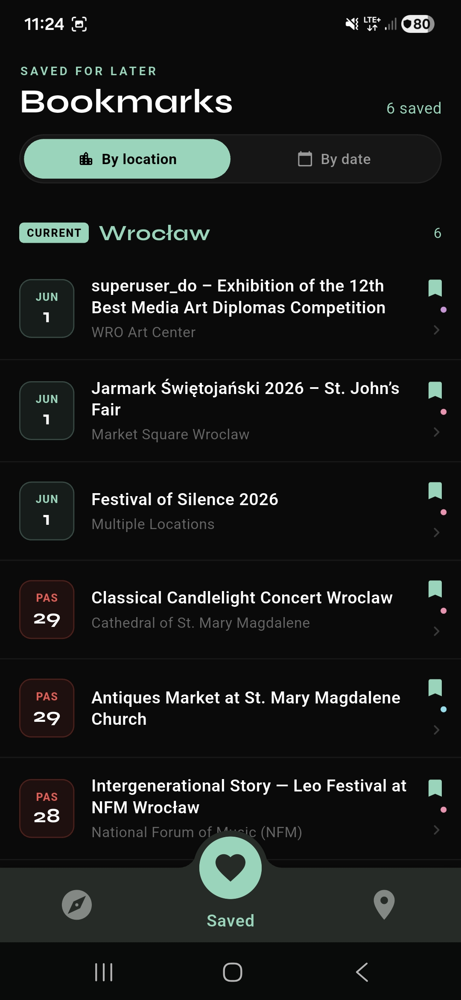
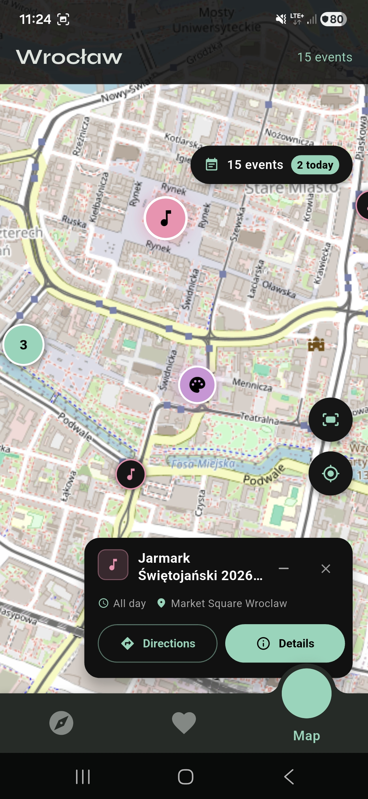

<h3 align="center">Event Radar</h3>
<p align="center">
  
</p>

<p align="center">
  Event Radar finds what's actually happening around you and keeps it in your pocket.
  Pick a city and the app serves a fresh, de-duplicated list of real events — concerts,
  exhibitions, festivals, markets — discovered automatically from across the web. The
  whole backend runs on free tiers, so there are zero server costs.
</p>

<p>With Event Radar you can:</p>
<ul>
  <li><b>Discover events</b> in any city — search by keyword and filter by category, date, and price (including a free-only filter), or sort by what's soonest or nearest.</li>
  <li><b>Browse a map</b> of nearby events, with live distance from your location shown in kilometres or miles.</li>
  <li><b>Save events</b> you care about to a personal bookmarks list that works offline.</li>
  <li><b>Get reminded</b> with local notifications before a saved event starts — with smart handling of multi-day events (see <a href="#notifications">Notifications</a>).</li>
  <li><b>See full details</b> — venue, description, price, ticket link, and the start time shown in the event's own timezone, not your phone's.</li>
  <li><b>Make it yours</b> — light / dark / system theme, English or Polish, and kilometres or miles, all switchable on the fly.</li>
  <li><b>Unlock new cities on demand</b> — pick a city nobody has indexed yet and the app spins up a fresh index in about two minutes.</li>
</ul>

<p>
  Whether you're looking for something to do tonight in your own city or planning ahead for
  a trip abroad, Event Radar is your shortcut to what's on.
</p>

<table align="center">
  <tr>
    <td align="center"></td>
    <td align="center"></td>
    <td align="center"></td>
  </tr>
  <tr>
    <td align="center">Discover</td>
    <td align="center">Bookmarks</td>
    <td align="center">Map</td>
  </tr>
</table>

<h3 id="notifications" align="center">Notifications</h3>

<p>
  Event Radar uses <b>local notifications</b> for the events you save — there's no push
  server and no account required. The instant you bookmark an event, a reminder is
  scheduled on the device; unsave it and that reminder is cancelled. Turning reminders off
  in Settings clears every pending one at once.
</p>

<p>When a reminder fires depends on the event:</p>
<ul>
  <li><b>Plenty of notice:</b> a heads-up <b>24 hours before</b> the event's start time.</li>
  <li><b>Saved late, or a multi-day event that's already running:</b> if the "day before"
      moment has already passed, the reminder instead fires at the event's <b>next daily
      session</b> — the next time its start clock-time comes around, as long as that still
      falls within the event's run. Save a 7-day festival that starts at 18:00 while it's
      already underway, and you'll be reminded at the very next 18:00.</li>
  <li><b>Already finished:</b> nothing is scheduled — there's nothing left to remind you about.</li>
</ul>

<p>
  Every reminder is anchored to the <b>venue's timezone</b>, and the schedule rebuilds the
  target date rather than adding a flat 24 hours, so the clock-time stays correct across
  daylight-saving changes. The app asks for the OS notification permission the first time it
  needs to schedule a reminder.
</p>

<h3 align="center">Technical Details</h3>

<p>
  The app is built with <b>Flutter</b>, so a single codebase runs natively on Android and
  iOS. Saved events and recently-picked cities are stored locally with <b>Hive</b>, which
  is why your bookmarks are available offline. The app is fully localized (English and
  Polish) with timezone-aware event times throughout.
</p>

<p>
  There is no traditional backend. Event data is produced by an automated pipeline and
  served as static JSON, so the app simply fetches files — keeping it fast and free to run:
</p>

<ul>
  <li><b>Indexer (GitHub Actions):</b> on the 1st of every month a Python pipeline reads
      publicly-available <a href="https://schema.org/Event">schema.org/Event</a> metadata
      that publishers embed in their pages, normalizes and de-duplicates it, and publishes
      one JSON file per city to <b>GitHub Pages</b>.</li>
  <li><b>On-demand indexing (Vercel):</b> when you pick a city that hasn't been indexed
      yet, the app calls a serverless function that triggers a one-off pipeline run and the
      app polls until the data is ready (~2 minutes). The city is then indexed every month
      from then on.</li>
  <li><b>App:</b> fetches the city's dataset, caches it, and renders the Discover, Map, and
      Saved experiences on top of it.</li>
</ul>

<h3 align="center">How indexing works</h3>

<table>
  <tr><th>Step</th><th>What happens</th></tr>
  <tr>
    <td>Discovery</td>
    <td>For each city, English <em>and</em> native-language search queries are generated
        (21 languages supported) to surface local event sites that English-only searches
        miss — e.g. <code>Veranstaltungen Berlin März 2026</code> alongside
        <code>events in Berlin</code>.</td>
  </tr>
  <tr>
    <td>Extraction</td>
    <td>Only structured data publishers have explicitly exposed is read —
        <code>&lt;script type="application/ld+json"&gt;</code> Event objects. Pages without
        structured data are skipped.</td>
  </tr>
  <tr>
    <td>Deduplication</td>
    <td>The same event often appears on many sites; records are de-duplicated by
        <code>sha256(title + date + venue)</code>, keeping the most complete one.</td>
  </tr>
  <tr>
    <td>Geocoding</td>
    <td>Venue coordinates come from the page data where available; otherwise Photon is
        queried once per unique venue per run.</td>
  </tr>
  <tr>
    <td>Timezones</td>
    <td>Times are stored in UTC, each dataset carrying the venue's IANA timezone. The app
        formats every time in the venue's zone, with a "venue time / your time" hint on the
        details screen.</td>
  </tr>
</table>

<h3 align="center">APIs & Services Used</h3>

<table>
  <tr>
    <th>API / Service</th>
    <th>Purpose</th>
  </tr>
  <tr>
    <td>Tavily Search API</td>
    <td>Discovers event-listing pages via multilingual web search during the indexing pipeline.</td>
  </tr>
  <tr>
    <td>Photon Geocoding (Komoot)</td>
    <td>Resolves venue coordinates for events whose embedded data has no latitude/longitude.</td>
  </tr>
  <tr>
    <td>GitHub Actions &amp; Pages</td>
    <td>Runs the monthly (and on-demand) indexing pipeline and hosts the resulting static JSON datasets for free.</td>
  </tr>
  <tr>
    <td>Vercel Serverless Functions</td>
    <td>Provides the on-demand city-indexing trigger and a dataset proxy the app talks to.</td>
  </tr>
</table>

---

## Repo layout

```
event-radar/
├── app/             # Flutter mobile app (Android + iOS)
├── api/             # Vercel serverless functions (trigger + dataset proxy)
├── indexer/         # Python event-discovery pipeline run by GitHub Actions
├── cities.txt       # Cities to index monthly (one Name:CC per line)
└── .github/workflows/pipeline.yml
```

## Data flow in detail

### Monthly run (automatic)

GitHub Actions runs on the 1st of every month at 06:00 UTC. It reads every city from `cities.txt`, runs the discovery pipeline for each, and deploys the resulting JSON files to GitHub Pages.

### On-demand run (new city)

When a user picks a city that hasn't been indexed yet:

1. Flutter calls `POST /api/trigger` with `{ city: "Gdańsk", country_code: "PL" }`
2. Vercel checks `index.json` — city not found or data is stale
3. Vercel checks the GitHub Actions API — no run already in progress
4. Vercel triggers `workflow_dispatch` for `Gdańsk:PL`
5. GitHub Actions indexes Gdańsk and appends it to `cities.txt` (so it runs every month from now on)
6. Flutter polls `/api/datasets?path=index.json` every 15 seconds
7. When `gdansk.json` appears in the index, Flutter fetches and displays the events

Total time from tap to events: **~2 minutes**.

### Broken upstream times

Many event-listing pages emit broken `startDate` values (e.g. the WordPress "Modern Events Calendar" plugin double-applies the UTC offset, so a 20:30 Warsaw event becomes `22:30+02:00` in the JSON-LD). The pipeline compensates by reinterpreting the strict-parsed UTC components as venue-local wall-clock time. See `indexer/pipeline.py::EventNormalizer._to_utc`.

## Dataset format

Each city gets a JSON file at `datasets/{slug}.json`:

```json
{
  "city": "Berlin",
  "slug": "berlin",
  "country_code": "DE",
  "timezone": "Europe/Berlin",
  "generated_at": "2026-03-01T06:00:00+00:00",
  "count": 83,
  "events": [
    {
      "id": "a1b2c3d4e5f6g7h8",
      "title": "Boiler Room Berlin",
      "city": "berlin",
      "start": "2026-03-15T21:00:00+00:00",
      "end": "2026-03-16T05:00:00+00:00",
      "venue": "Tresor",
      "latitude": 52.5094,
      "longitude": 13.4194,
      "description": "...",
      "url": "https://...",
      "source": "residentadvisor.net",
      "price": "EUR 15",
      "category": "Music",
      "updated_at": "2026-03-01T06:00:00+00:00"
    }
  ]
}
```

`datasets/index.json` lists all available cities with their slugs, event counts, and last-updated timestamps. This is what Flutter and the Vercel trigger function use to look up whether a city exists.

## Flutter app

Feature-folder layout under `app/lib/`:

```
lib/
├── main.dart
├── app_shell.dart        # bottom-nav shell hosting the three tabs
├── core/
│   ├── config.dart
│   ├── app_bootstrap.dart
│   ├── models/           # Event, EventCategory, CityItem, …
│   ├── services/         # EventService, CityService, EventCacheService,
│   │                     #   NotificationService, SettingsService, BookmarkActions
│   ├── theme/            # AppColors, AppShadows, typography
│   └── utils/            # event_time (timezone-aware), date_filter, …
├── features/
│   ├── discover/         # screen + per-feature widgets/
│   ├── map/
│   ├── saved/
│   └── event_details/
├── l10n/                 # ARB files + generated/ (en, pl)
└── widgets/              # shared widgets
```

- **Localization:** English (template) and Polish; the device locale is auto-detected at startup. Add a locale by dropping `lib/l10n/app_<code>.arb` next to the others and running `flutter gen-l10n`. Plural-sensitive keys use ICU syntax so Polish gets correct grammar.
- **Persistence (Hive):** `bookmarks` (saved events) and `recent_cities`.
- **Notifications:** scheduled by `NotificationService` and wired into the save/unsave flow by `BookmarkActions` (see [Notifications](#notifications)).
- **Config:** `app/lib/core/config.dart` reads `VERCEL_BASE` from `--dart-define`, e.g. `https://event-radar.vercel.app`.

## Running locally

### Flutter app

```bash
cd app
flutter pub get
flutter gen-l10n
flutter run --dart-define=VERCEL_BASE=https://your-deploy.vercel.app
```

### Vercel API (local dev)

```bash
cd api
npm install
vercel dev
```

`.env.local` needs:

```
GITHUB_OWNER=<your-gh-user>
GITHUB_REPO=event-radar
GITHUB_TOKEN=<PAT with workflow + contents:write scopes>
```

### Discovery pipeline (one-off run)

```bash
cd indexer
python -m venv .venv
.venv\Scripts\Activate.ps1            # PowerShell
# source .venv/bin/activate           # bash
pip install -r requirements.txt
python main.py --city "Wrocław:PL"
```

Set `TAVILY_API_KEY` in your environment first (get one at https://tavily.com).

## Deployment

- **Indexer:** GitHub Actions (`.github/workflows/pipeline.yml`). Secrets required: `TAVILY_API_KEY`. Output goes to GitHub Pages.
- **API:** Vercel project pointing at `api/`. Env vars: `GITHUB_OWNER`, `GITHUB_REPO`, `GITHUB_TOKEN`.
- **App:** Flutter build for Android/iOS as usual.

## License

See `LICENSE`.
